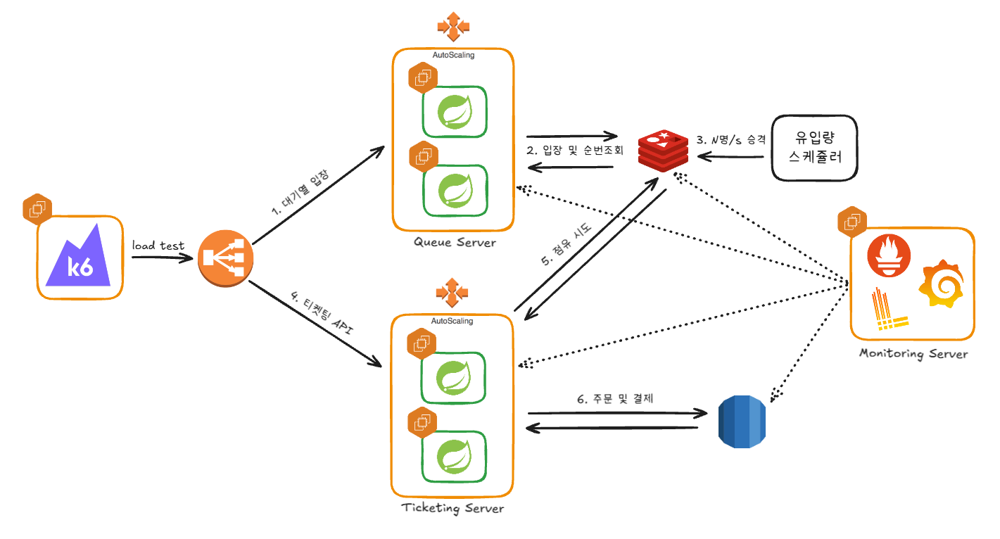

# 🎟️ 대기열 콘서트 티켓팅 프로젝트

> 목표 응답시간과 TPS를 정하고 만든 대기열 콘서트 티켓팅 프로젝트입니다.

---

## 📌 프로젝트 소개

티켓 오픈 시점에는 평소의 수백 배 트래픽이 몇 초 안에 몰립니다. 이때 서버가 감당하지 못하면 대기 없이 전부 실패하거나, 일부만 성공하고 나머지는 이유를 알 수 없는 오류를 받습니다.

이 프로젝트는 **"얼마나 빨라야 하는가"를 먼저 정하고 그 수치를 만족하는 처리량을 찾는 순서**로 만들었습니다. 목표 SLO를 세운 뒤 부하 테스트로 그 SLO를 지킬 수 있는 TPS를 측정하고, 대기열 승격 스케줄러가 초당 그만큼만 예매 서버로 통과시킵니다. 예매 서버는 자신이 감당 가능한 만큼만 받고, 나머지 사용자는 자기 순번과 다음 조회 시점을 안내받으며 기다립니다.

### 👥 사용자 가정

DAU와 사용자 행동 패턴을 가정해 목표치를 산출했습니다.

| 구분 | 가정 |
| --- | --- |
| **DAU** | 10만 명 |
| **서핑 목적 (90%)** | 9만 명 × 100회 요청 → 하루 900만 건, 평균 104 TPS |
| **티켓팅 목적 (10%)** | 1만 명 × 50회 요청 → 하루 50만 건, 평균 6 TPS |
| **Think Time** | 좌석 전체 조회 → 좌석 결정 → 점유 시도까지 약 2초 |
| **조회 빈도** | 점유를 3회 시도한 뒤 좌석 전체를 다시 조회 |

### 🎯 목표 수치

| 목표 | 값 | 근거 |
| --- | --- | --- |
| **평시 목표 TPS** | 300 | 산출된 평균 110 TPS * 피크 가중치 (2) + 여유분 (10~20%) 을 더한 값 |
| **평시 목표 Latency** | 전체 API P95 300ms | `k6/normal.js` |
| **티켓팅 구간 SLO** | 전체 API P95 200ms | `k6/ticketing.js`, 결제 API는 PG 모방 구간이라 제외 |

---

## 🗓️ 작업 기간

**2026년 7월 초 ~ 2026년 8월 말** · 개인 프로젝트

---

## ✨ 주요 기능

### 🚪 대기열 입장과 순번 조회

- 예매하기를 누르면 Redis Sorted Set에 순번이 등록되고, 순번 조회에 사용할 대기열 토큰(JWT)을 발급합니다.
- 토큰에는 `queueSessionId`를 담아 한 사용자가 여러 화면에서 동시에 대기하지 못하도록 막습니다. 다른 화면에서 이어받으면 기존 화면의 폴링은 `SESSION_REVOKED`로 종료됩니다.
- 대기열 서버는 DB에 접속하지 않고 Redis만 사용하며, 사용자의 입장과 순번 조회 기능을 처리합니다.

<br>

### ⏱️ 순번에 따른 폴링 주기 차등과 지터

곧 입장할 사용자에게는 짧은 주기로 체감을 살리고, 뒤쪽 사용자에게는 긴 주기를 줘서 폴링 자체가 부하가 되지 않도록 했습니다.

| 대기 순번 | 폴링 주기 | 지터 |
| --- | --- | --- |
| 100 이내 | 1초 | ❌ 적용하지 않음 |
| 1,000 이내 | 2초 | ✅ 적용 |
| 10,000 이내 | 5초 | ✅ 적용 |
| 100,000 이내 | 10초 | ✅ 적용 |
| 그 이상 | 30초 | ✅ 적용 |

같은 주기를 받은 사용자들이 동시에 폴링하지 않도록, 100번 이후 구간에는 무작위 지터를 더해 순간 부하를 방지합니다.

<br>

### 🔒 승격 스케쥴러와 순번 조회 간 원자성

- 티켓팅 서버의 승격 스케줄러가 1초마다 대기열 앞쪽 N명을 작업열(Active)로 올립니다.
- `ZPOPMIN`과 Active 등록 `SET` 사이에 순번 조회 `ZRANK` 가 끼어들면 대기열에도 작업열에도 없는 순간이 생기므로, 두 동작을 Lua 스크립트 하나로 원자 처리합니다.
- 작업열 슬롯은 TTL(기본 420초)로 만료되어, 예매를 마치지 않고 이탈한 사용자의 자리를 자동으로 회수합니다.

<br>

### 💺 좌석 점유의 원자성

- 여러 좌석을 한 번에 고르는 경우, 하나라도 이미 점유돼 있으면 전체를 실패시키는 all-or-nothing 방식으로 Lua 스크립트에서 처리합니다.
- 점유는 Redis 키의 TTL로 유지되므로, 결제까지 가지 않은 좌석은 별도 정리 작업 없이 풀립니다. 사용자별·회차별 인덱스를 함께 갱신해 점유 좌석을 만료 시각 순으로 조회합니다.

<br>

### 💳 주문·결제와 정합성 복구

- 카카오페이 PG API는 `ready` → `approve` 흐름으로 결제를 진행합니다.
- PG 승인은 성공했는데 서버 크래시로 로컬에 반영되지 못한 건, PG 호출에 실패해 `PENDING`으로 남은 주문, 환불 요청 후 `CANCEL_REQUESTED`로 멈춘 건을 각각 스케줄러가 주기적으로 재조회해 마무리합니다.
- 인스턴스가 여러 대여도 스케줄러가 중복 실행되지 않도록 ShedLock으로 잠급니다.

<br>

### ⚡ 조회 트래픽을 위한 계층 캐시

- 콘서트·회차 조회는 L1(Caffeine) + L2(Redis) 계층 캐시를 통과합니다. Spring Cache SPI를 구현해 `@Cacheable`을 그대로 쓰면서 아래 동작이 붙습니다.
- **캐시 스탬피드 방어** — 확률적 조기 재계산(PER)으로 만료 시점을 흩뜨리고, 같은 인스턴스 안에서는 SingleFlight로, 인스턴스 사이에서는 Redisson 분산 락으로 원본 조회를 한 번만 수행합니다.
- **무효화 전파** — 데이터가 바뀌면 Redis Pub/Sub으로 모든 인스턴스의 L1을 함께 비웁니다.

---

## 🛠️ 기술 스택

| 영역 | 스택 |
| --- | --- |
| **Backend** |     |
| **Database** |   |
| **대기열/동시성** |      |
| **Cache** |    |
| **대기열 토큰** |  |
| **Infra** |       |
| **CI/CD** |    |
| **모니터링** |      |
| **테스트** |   |

---

## 🏗️ 아키텍처



---

## 📁 패키지 구조

```
.
├── ticketingServer/                  예매 티켓팅 서버
│   └── src/main/
│       ├── java/ticketing/
│       │   ├── domain/               
│       │   │   ├── concert/          콘서트 관련 엔티티
│       │   │   ├── order/            주문 관련 엔티티
│       │   │   └── payment/          주문 정보 관련 엔티티
│       │   └── global/               공통 포맷, Config, Cache, MDC, util
│       └── resources/
│           └── luaScripts/           
├── queueServer/                      대기열 서버
│   └── src/main/java/queue/
│       ├── domain/queue/             대기열 관련 서비스
│       └── global/                   공통 포맷
├── k6/                               부하 테스트 시나리오
├── monitoring/                       Prometheus · Loki · Grafana · Exporters
├── ASG/                              Auto Scaling Group userdata 스크립트
├── jenkins/                          배포 스크립트
└── images/
```

각 도메인 패키지는 `controller / service / repository` 구조를 따르며, 여기에 `entity`, `dto`, `exception`을 함께 둡니다. 조회와 변경이 갈리는 도메인은 `QueryService`와 `CommandService`로 나누고, 여러 서비스를 엮어 트랜잭션 경계를 잡는 곳에만 `FacadeService`를 둡니다. 스케줄러가 필요한 도메인은 `scheduler` 패키지를 추가합니다.

`global`에는 도메인이 공유하는 것만 둡니다. `apiPayload`는 공통 응답 포맷과 예외 코드, `cache`는 계층 캐시 구현, `config`는 Redis·DataSource·스케줄러 설정, `mdc`는 요청 추적용 로깅 필터입니다.

---

## 문서

### 작업 사항

| 작업 사항 | 내용 |
| --- | --- |
| [대기열 티켓팅 서비스 개요](https://app.notion.com/p/3972c9c57e2980a5a9f7f59d74661c35) | 서비스 전반의 구조와 설계 의도 |
| [순번 조회 점진적 Polling](https://app.notion.com/p/Polling-3c72c9c57e298068a59fd8c6fc666729) | 대기 순번에 따른 폴링 주기 차등과 지터 설계 |
| [대기열 토큰 JWT](https://app.notion.com/p/JWT-3c72c9c57e2980cd81b1ddbbb80d7643) | 대기열 토큰 설계와 queueSessionId 기반 화면 제어 |
| [ZSET Score, currentTimeMillis()의 문제점](https://app.notion.com/p/ZSET-Score-currentTimeMillis-3c72c9c57e29808da353e73219e023bb) | 대기열 순번 스코어로 시각을 쓸 때 생기는 문제와 대안 |
| [스케쥴러의 승격과 순번 조회 간 Race Condition](https://app.notion.com/p/Race-Condition-3c72c9c57e2980ae85bef7583d965067) | ZPOPMIN과 작업열 등록 사이의 공백을 Lua로 없앤 과정 |
| [PG API 트랜잭션 분리 및 Facade 기반의 오케스트레이션](https://app.notion.com/p/PG-API-Facade-3c62c9c57e298098ba2de7acfc0a13d2) | 외부 PG 호출을 트랜잭션 밖으로 빼고 Facade로 흐름을 조립한 방식 |
| [서버 크래시에 대응한 결제 복구 스케쥴러](https://app.notion.com/p/3c62c9c57e2980118a2cfbacfcecd539) | READY·PENDING·CANCEL_REQUESTED로 남은 건을 PG 재조회로 마무리하는 방법 |
| [MGET 기반 조회에서 역인덱스 기반으로 조회 API 개선](https://app.notion.com/p/MGET-API-3c62c9c57e2980dcb904e45b11527540) | 좌석 전수 MGET 대신 사용자별·회차별 인덱스로 점유 조회를 바꾼 과정 |
| [2 Level Cache 및 Cache Stampede 대응](https://app.notion.com/p/2-Level-Cache-Cache-Stampede-3c62c9c57e2980c3b8c4c82a13ae8d54) | L1·L2 계층 캐시 구성과 PER·SingleFlight·분산 락으로 스탬피드를 막은 방법 |
| [좌석 점유 Lua Script](https://app.notion.com/p/Lua-Script-3c62c9c57e298047ad55e6ef2f9bcd1a) | 다중 좌석을 all-or-nothing으로 점유하는 스크립트 설계 |

<br>

### 테스트

| 테스트 사항 | 내용 |
| --- | --- |
| [평균적인 운영 상황 설정, DAU 및 사용자 행동 패턴 가정](https://app.notion.com/p/DAU-3c52c9c57e2980c8ac12fd375706f2d1) | 상황 설정과 처리해야하는 요청수 계산 |
| [평균적인 운영 상황 테스트](https://app.notion.com/p/3c62c9c57e29808bbb9eca7e831b7b78) | 목표 TPS 300, 전체 API P95 300ms 달성 여부 측정 |
| [티켓팅 서버 테스트](https://app.notion.com/p/3c62c9c57e29807c9905c2e98396b51d) | 대기열 통과 이후 예매 구간에서 P95 200ms를 지키는 TPS 측정 |
| [유입량 테스트](https://app.notion.com/p/3c62c9c57e298037a403ff5ef2f2f018) | 대기열과 예매를 함께 돌려 승격 유입량이 적정한지 확인 |

<br>

### 이미지

| 작업 사항 | 내용 |
| --- | --- |
| [AWS 구축](https://app.notion.com/p/AWS-3c62c9c57e2980d6806fd0fb5b84b5a7) | AWS 인프라 구축 화면 캡처 |
